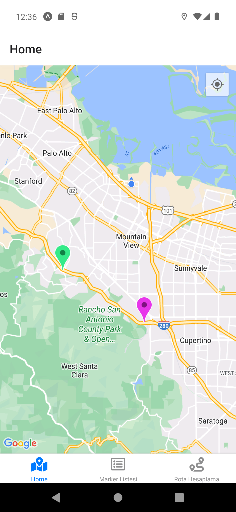
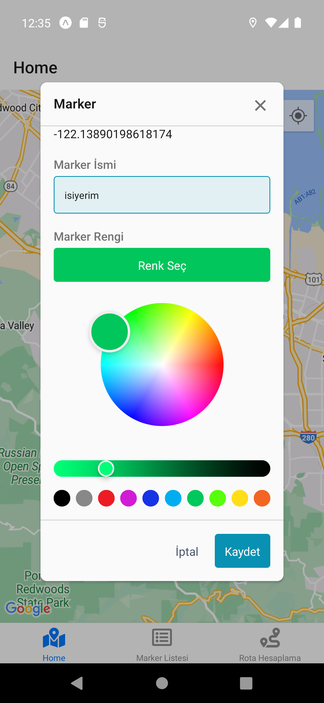
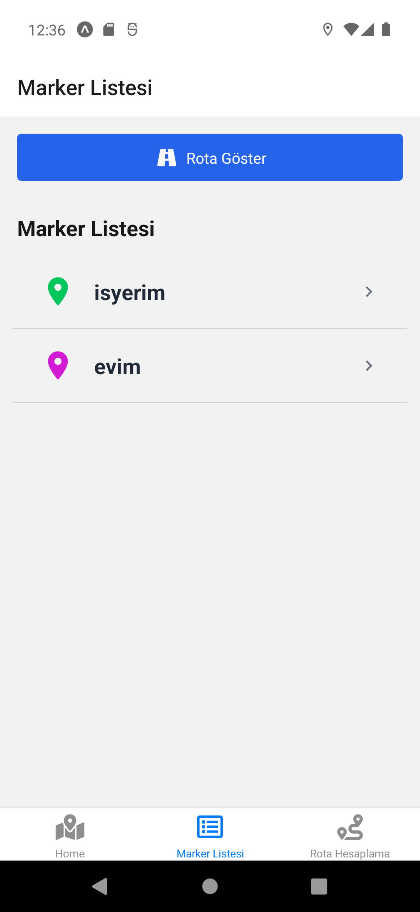
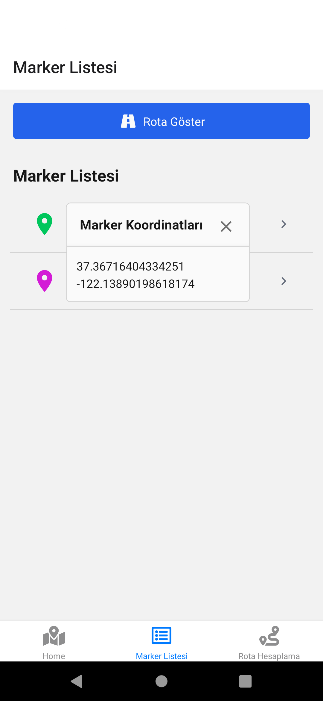
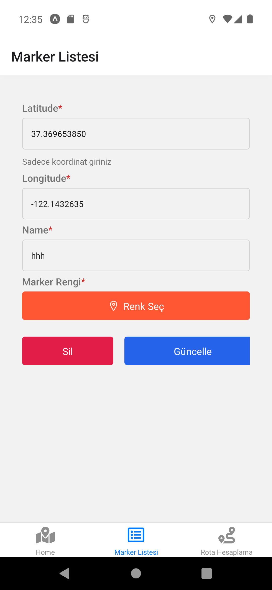
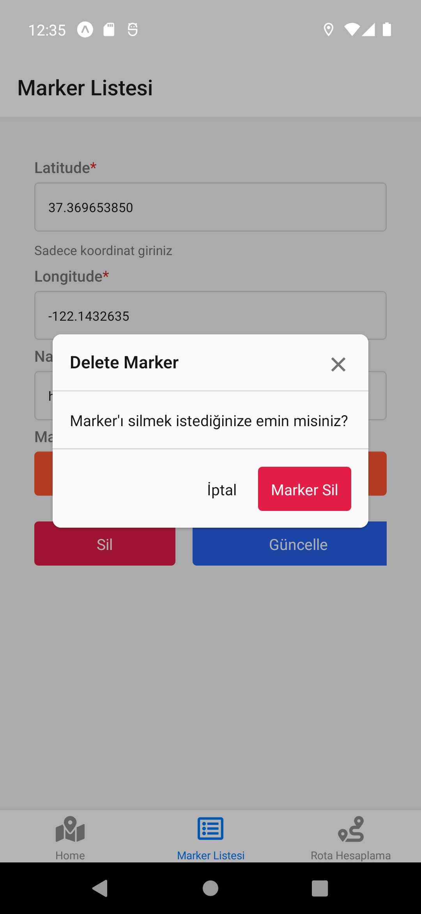
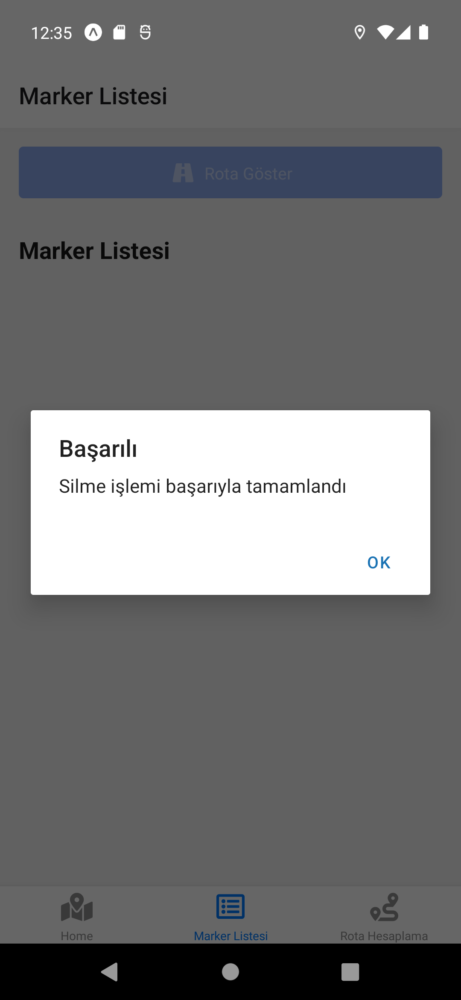
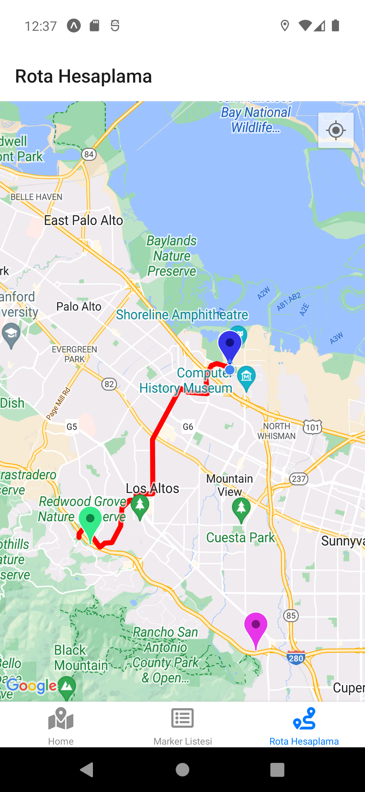
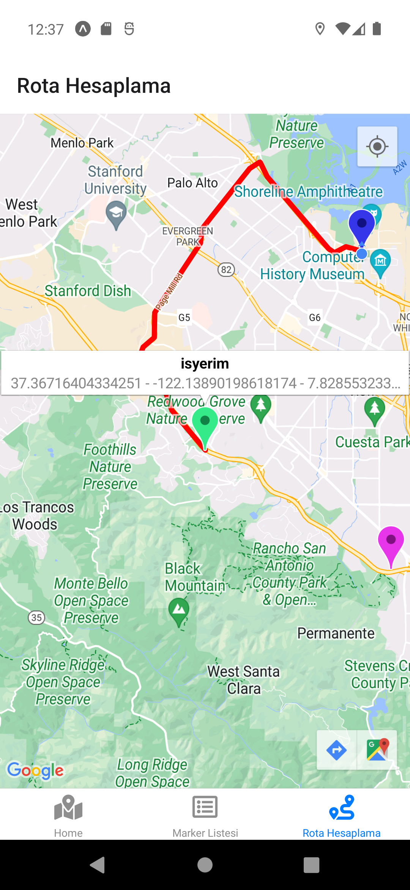

# Kullanıcı Konum Takip ve İşaretleme Uygulaması

Kendi dünyanızı haritada çizin! Kullanıcı Konum Takip ve İşaretleme uygulamamızla artık her anınızı anlamlandırabilir ve paylaşabilirsiniz. Bu mobil uygulama, kullanıcıların dünyalarını haritada işaretleyebilmeleri, bu önemli noktaları listeleyebilmeleri, diledikleri zaman silebilmeleri ve hatta güncelleyebilmeleri için tasarlandı. Ancak sadece bu kadarla sınırlı değil!

## Öne Çıkan Özellikler

## Konum İşaretleme ve Güncelleme

Uygulama, kullanıcılara anlık olarak konumlarını işaretleme ve bu konumları güncelleme imkanı tanır. Yeni bir anı yaşadığınızda veya önemli bir yeri ziyaret ettiğinizde sadece parmak uçlarınızla haritaya dokunun ve anılarınızı kaydedin!

## Konum Listeleme ve Silme

Belki de geçmişte işaretlediğiniz bir konumu güncellemek istiyorsunuz veya belirli bir konumu silmek istiyorsunuz. Uygulamamız size konumlarınızı rahatça listeleyip düzenleme veya silme olanağı sağlar.

## Anlık Konum Takibi

Uygulama, kullanıcıların harita üzerinde kendi konumlarını anlık olarak takip edebilmelerini sağlar. Nerede olduğunuzu görmek için sadece bir göz atın ve yolda olun!

## Rota Çizme ve Mesafe Hesaplama

Belirli bir konumdan kendi konumunuza rota çizme özelliği sayesinde, hedefinize en hızlı şekilde nasıl ulaşabileceğinizi keşfedin. Ayrıca, mesafe bilgisi ile yolculuğunuzun ölçüsünü alın.

## Kullanılan Teknolojiler

- React Native: Mobil uygulama geliştirmek için kullanılan bir framework.
- NativeBase: React Native için UI bileşenleri sunan bir kütüphane.
- React Native Maps: Harita işlemleri için kullanılan bir React Native kütüphanesi.
- Expo: React Native projelerini hızlı bir şekilde geliştirmek ve dağıtmak için kullanılan bir çerçeve.
- Zustand: React uygulamaları için state yönetimi sağlayan bir kütüphane.
- UUID: Benzersiz kimlik (UUID) oluşturmak için kullanılan bir kütüphane.

## Kurulum

**1. Projeyi klonlayın:**

     git clone https://github.com/yasin03/map-app.git

**2. Proje klasörüne gidin,**

**3. Gerekli paketleri yükleyin:**

     npm install or yarn add

**4. Expo CLI ile projeyi başlatın:**

     npm start or yarn start

**5. Uygulamayı bir simülatörde çalıştırın veya fiziksel bir cihazda Expo Client uygulamasını kullanarak tarayın.**

## Uygulama Resimleri

## Lisans

Bu proje MIT lisansı altında lisanslanmıştır. Detaylar için [Lisans Dosyası](LICENCE)
